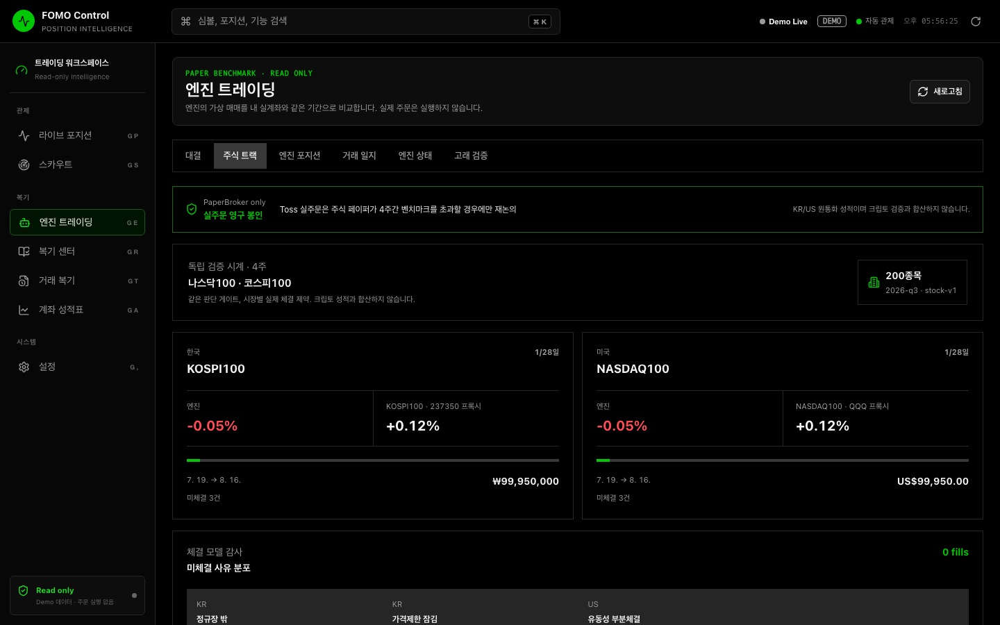

# Toss 주식 페이퍼 트레이딩 운영·검산

## 경계

- 크립토 페이퍼는 `app/paper`와 기존 USDT 시계를 그대로 사용한다.
- 주식 페이퍼는 `app/stock_paper`의 KRW/USD 계정과 KR/US 4주 시계를 사용한다. 두 성적은 합산하지 않는다.
- 주식 진입·리스크 임계값은 `app/stock_paper/params/stock-v1.json`에서 버전 관리한다. 크립토 페이퍼 파라미터를 읽거나 변경하지 않는다.
- 주문 경로는 `PaperBroker`뿐이다. `LiveBroker`는 Protocol이며 구현체·레지스트리가 없다. `FCE_STOCK_LIVE_TRADING_ENABLED=true`는 설정 검증에서 기동 실패한다.
- Toss 클라이언트 허용 경로에는 주문·계좌 API가 없다.
- 독립 4주 시계는 주식 엔진, Toss 수집기, client id/secret이 모두 준비된 시점에만 생성한다. 자격정보가 없는 개발 서버를 열었다는 이유로 검증 시간이 흐르지 않는다.

## 체결 정직성

체결 순서는 정규장 → warnings/VI/정지 → 가격제한 잠김 → 당분 거래량 5% → 반스프레드 → 호가단위 → 당분 고저 invariant다. 장외 주문은 `session_closed`로 큐잉되고 다음 정규장 첫 관측 시가를 사용한다. 첫 시가, 1분 OHLCV, 호가 중 하나라도 없으면 `market_data_missing`이며 체결하지 않는다.

KR 체결은 원화 수수료와 매도 거래세, US 체결은 달러 수수료를 저장한다. USD→KRW 환율은 Toss의 1분 유효 참고 환율이 실제로 응답한 경우에만 fill에 관측 시각과 함께 저장한다. 환율이 없으면 빈칸이다.

## 벤치마크 정직성

Toss 시장지표 API의 현재 공식 카탈로그는 KOSPI/KOSDAQ과 국내 국채만 제공하며 KOSPI100·Nasdaq-100 지수 심볼은 제공하지 않는다. 따라서 같은 Toss 가격 소스 안에서 다음 비레버리지 ETF를 명시적 프록시로 사용한다.

- KOSPI100: KODEX 코스피100 `237350`
- Nasdaq-100: Invesco QQQ `QQQ`

화면과 API는 `benchmark_method=unlevered_etf_proxy_close`와 프록시 심볼을 항상 노출한다. ETF 보수·추적 오차 때문에 “지수 자체”로 표기하지 않는다. 프록시 가격이 없으면 벤치마크 수익률도 빈칸이다.

## TPS 검산 (200종목 + 프록시 2종목)

KR/US 각 100종목과 시장별 프록시 1개는 200건 배치 한도 안에서 각각 1콜이다. KR/US 수집기는 동일 client/API-group 토큰 버킷을 공유한다.

| 그룹 | 호출 | 정상상태 환산 | 공식 한도 | 판정 |
|---|---:|---:|---:|---|
| MARKET_DATA | 현재가 2콜/10초 + 후보 36종목×3콜/15초 + 비후보 보유종목 최대 10종목×3콜/15초 | 최대 9.4 TPS | 10 TPS | 통과 |
| MARKET_DATA_CHART | 후보 36종목 + 비후보 보유종목 최대 10종목의 1분봉/15초 + 일봉 백필 2콜/10초 | 최대 3.27 TPS | 5 TPS | 통과 |
| STOCK | 종목 메타 2콜/10초, warnings는 종목별 24시간 캐시 | 상시 0.2 TPS | 5 TPS | 통과 |
| RANKING | 시장별 6콜/60초 | 0.2 TPS | 5 TPS | 통과 |
| MARKET_INFO | 캘린더 2콜/10초 + USD/KRW 1콜/10초 | 0.3 TPS | 3 TPS | 통과 |

후보는 시장별 상위 18개로 제한한다. 시장별 최대 5개 포지션이 모두 후보 밖인 최악 조건까지 계산한 값이다. 비후보 유니버스는 시장별 한 종목씩 순환하며 일봉 200개를 백필해 약 17분에 100종목을 한 번 순회한다. `X-RateLimit-Remaining`이 20% 아래로 내려가면 공유 버킷이 선제 감속하고 429는 Retry-After와 지수 백오프로 재시도한다.

## 관측·복기

GE의 `주식 트랙`은 시장별 시작일/28일, 원통화 NAV, 프록시 수익률, 미체결 사유, 최근 fill의 수수료·세금을 표시한다. GR 요약은 같은 주식 트랙으로 연결한다. `stock_paper_events`가 세션·가격제한·VI·유동성·데이터 누락을 실제 발생 건수로 보존한다.

참고 출처:

- [Toss Securities Open API](https://developers.tossinvest.com/docs)
- [Nasdaq-100 companies](https://www.nasdaq.com/solutions/global-indexes/nasdaq-100/companies)
- [KRX 정보데이터시스템](https://data.krx.co.kr/contents/MDC/MAIN/main/index.cmd?locale=ko)
- [KODEX 코스피100](https://www.samsungfund.com/etf/product/view.do?id=2ETF57)
- [Invesco QQQ](https://www.invesco.com/us/financial-products/etfs/product-detail?productId=QQQ&ticker=QQQ)
