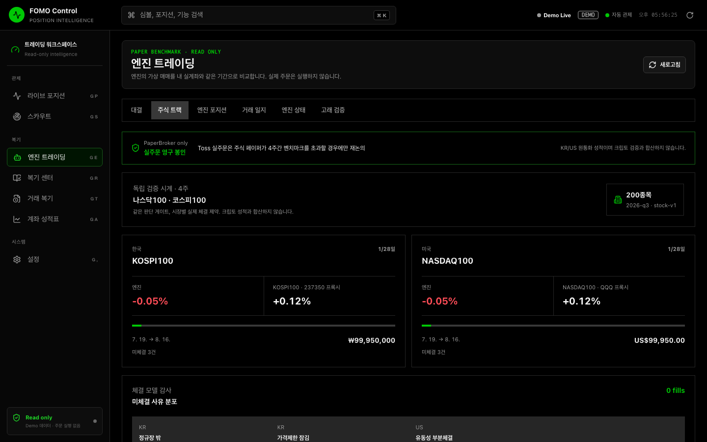

# Toss 주식 페이퍼 트레이딩 운영·검산

주식 분석 스냅샷은 리포트가 포함한 `datetime`·UUID·Enum을 JSON 안전 값으로 변환해
저장한다. 이 저장 단계가 실패하면 해당 수집 tick은 성공으로 기록하지 않으며 워커
heartbeat의 오류에서 확인한다.

## 경계

- 크립토 페이퍼는 `app/paper`와 기존 USDT 시계를 그대로 사용한다.
- 주식 페이퍼는 `app/stock_paper`의 KRW/USD 계정과 KR/US 4주 시계를 사용한다. 두 성적은 합산하지 않는다.
- 주식 진입·리스크 임계값은 `app/stock_paper/params/stock-v4.json`에서 버전 관리하며 v1~v3는 감사·재생 기준으로 보존한다. 크립토 페이퍼 파라미터를 읽거나 변경하지 않는다.
- 주문 경로는 `PaperBroker`뿐이다. `LiveBroker`는 Protocol이며 구현체·레지스트리가 없다. `FCE_STOCK_LIVE_TRADING_ENABLED=true`는 설정 검증에서 기동 실패한다.
- Toss 클라이언트 허용 경로에는 주문·계좌 API가 없다.
- 독립 4주 시계는 자격정보 존재가 아니라 시장별 첫 인증 성공 `status=observed`에서 시작한다. 인증 실패·순환 봉쇄 기간은 무효 사유와 함께 제외한다.

## 체결 정직성

체결 순서는 정규장 → warnings/VI/정지 → 가격제한 잠김 → 당분 거래량 5% → 반스프레드 → 호가단위 → 당분 고저 invariant다. 장외 주문은 `session_closed`로 큐잉되고 다음 정규장 첫 관측 시가를 사용한다. 첫 시가, 1분 OHLCV, 호가 중 하나라도 없으면 `market_data_missing`이며 체결하지 않는다. Toss가 아직 거래가 없는 현재 분봉을 거래량 0으로 반환하면 체결 근거로 쓰지 않고, 가장 최근의 거래량 있는 확정 1분봉을 사용한다.

세션 판정은 KR `integrated.regularMarket`, US `regularMarket` 만 사용한다(프리·애프터 제외). 다만 **`today` 한 항목만 보지 않는다** — 미국 정규장은 KST 자정을 넘겨 이어지므로 `today`·`previousBusinessDay`·`nextBusinessDay` 세 후보의 정규장 창을 모두 보고 현재 시각을 포함하는 창이 있으면 개장으로 본다(아래 'KST 자정 롤오버' 참조). 미국 day/pre/after market은 수집은 가능하지만 PaperBroker 체결 세션으로 보지 않는다.

KR 체결은 원화 수수료와 매도 거래세, US 체결은 달러 수수료를 저장한다. USD→KRW 환율은 Toss의 1분 유효 참고 환율이 실제로 응답한 경우에만 fill에 관측 시각과 함께 저장한다. 환율이 없으면 빈칸이다.

## 벤치마크 정직성

Toss 시장지표 API의 현재 공식 카탈로그는 KOSPI/KOSDAQ과 국내 국채만 제공하며 KOSPI100·Nasdaq-100 지수 심볼은 제공하지 않는다. 따라서 같은 Toss 가격 소스 안에서 다음 비레버리지 ETF를 명시적 프록시로 사용한다.

- KOSPI100: KODEX 코스피100 `237350`
- Nasdaq-100: Invesco QQQ `QQQ`

화면과 API는 `benchmark_method=unlevered_etf_proxy_close`와 프록시 심볼을 항상 노출한다. ETF 보수·추적 오차 때문에 “지수 자체”로 표기하지 않는다. 프록시 가격이 없으면 벤치마크 수익률도 빈칸이다.

## TPS 검산 (200종목 + 프록시 2종목)

KR/US 각 100종목과 시장별 프록시 1개는 200건 배치 한도 안에서 각각 1콜이다. KR/US 수집기는 동일 client/API-group 토큰 버킷을 공유한다.

| 그룹 | 호출 | 정상상태 환산 | 공식 한도 | 판정 |
|---|---:|---:|---:|---|
| MARKET_DATA | 현재가 2콜/10초 + 후보 36종목×3콜/15초 + 비후보 보유종목 최대 10종목×3콜/15초 | 최대 9.4 TPS | 10 TPS | 통과 |
| MARKET_DATA_CHART | 후보 36종목 + 비후보 보유종목 최대 10종목의 1분봉/15초 + 후보 일봉 36콜/일 + 일봉 백필 2콜/10초 | 정상 최대 3.27 TPS | 5 TPS | 통과 |
| STOCK | 종목 메타 2콜/10초, warnings는 종목별 24시간 캐시 | 상시 0.2 TPS | 5 TPS | 통과 |
| RANKING | 시장별 6콜/60초 | 0.2 TPS | 5 TPS | 통과 |
| MARKET_INFO | 캘린더 2콜/10초 + USD/KRW 1콜/10초 | 0.3 TPS | 3 TPS | 통과 |
| AUTH | 토큰 캐시(만료 60초 전 갱신) + 401 강제 재발급 | 상시 0.0 TPS · 최악 0.03 TPS | 5 TPS | 통과 |

**차단 재시도 반영 검산 (WO-FCE-TOSS-US-STALL-01, C4).** 자동 재시도를 도입해도 호출량은
**늘지 않고 줄어든다** — 차단 중에는 네트워크 호출이 0이기 때문이다.

| 상태 | 이전 | 현재 | 증감 |
| --- | --- | --- | --- |
| 인증 차단 중 | 0콜 (영구 정지, 20.8시간 실측) | 백오프당 1콜 (최악 60초당 1콜 = 0.017 TPS) | +0.017 TPS |
| `edge_blocked` 중 | **10초당 1콜 = 0.1 TPS** (래치 없어 무한 반복) | 최악 60초당 1콜, 이후 300→900→1800초 | **−0.083 TPS** |
| 점검(maintenance) 중 | 900초당 1콜 | 동일 | 0 |
| 정상 수집 | 표 위 그대로 | 동일 (재시도 경로는 차단 시에만 작동) | 0 |

인증 재시도 1회당 토큰 재발급 1콜이 추가될 수 있으나(AUTH 그룹, 5 TPS 한도), 백오프 하한이
60초이므로 최악 0.017 TPS다. 재시도는 시장별 독립이라 KR·US 동시 차단 시에도 0.034 TPS.

엄격 후보는 시장별 상위 18개로 제한한다. 별도 coverage 스캐너는 시장별 2종목씩 버전 고정 유니버스를 순환하며 현재가·warnings·호가·체결·가격제한·1분봉을 모두 받은 종목만 실행 표본 후보로 만든다. 후보 일봉 200개는 종목별 하루 한 번만 갱신하고 나머지 15분 주기는 저장본을 공용 분석에 사용한다. 최초 백필 버스트도 5 TPS 공유 버킷이 직렬화한다. 시장별 최대 5개 포지션이 모두 후보 밖인 최악 조건까지 계산한 값이다. 비후보 유니버스는 시장별 한 종목씩 순환하며 일봉 200개를 백필해 약 17분에 100종목을 한 번 순회한다. `X-RateLimit-Remaining`이 20% 아래로 내려가면 공유 버킷이 선제 감속하고 429는 Retry-After와 지수 백오프로 재시도한다.

## 구동 잡·엔진 플래그 관계 (침묵 금지)

주식 페이퍼는 두 플래그로 나뉜다.

- `FCE_TOSS_STOCK_SCOUT_ENABLED` (구동 잡 `toss_stock_scout`, 기본 **False**): Toss 시장 수집 + `run_stock_paper_engine` 실행 주기를 만든다. 이 잡이 꺼지면 엔진은 **한 번도 호출되지 않는다**.
- `FCE_STOCK_PAPER_ENGINE_ENABLED` (엔진, 기본 **True**): 엔진 내부 활성 여부. 상태 화면·설정에는 이 값이 노출된다.

두 값이 어긋나면(엔진 True · 구동 잡 False) 상태 화면엔 "활성"으로 보이지만 실행되지 않는 **스플릿 플래그 함정**이 된다. `run_stock_paper_engine`의 `_ready_to_start`도 `toss_stock_scout_enabled`를 요구하므로, 구동 잡이 꺼진 상태에서 엔진을 직접 호출해도 `toss_observation_not_configured`로 조기 반환한다.

이 불일치는 이제 **조용히 유지되지 않는다**. `WorkerManager`가 기동 시 명시적 경고를 발행하고(`worker flag inconsistency`), `status()["flag_warnings"]`와 `/api/system/paper/diagnosis`에 노출한다. 주식 페이퍼를 실제로 돌리려면 두 플래그를 모두 켜야 한다. 자세한 계약은 [`docs/PaperObservability.md`](PaperObservability.md).

## 검증 시계 유실일 처리

주식 트랙의 검증 경과일은 달력일이 아니라 **엔진이 정상적으로 평가를 수행한 날**(effective run)로 세는 것이 정직하다. 워커가 죽었거나 구동 잡이 꺼져 있던 날 = 원장 미축적 = 검증일 유실이며, 이를 정상 경과로 계산하면 안 된다.

이 WO에서 관측 기반을 놓았다: 워커 하트비트 `last_effective_run_at`(마이그레이션 `0031`)이 엔진이 실제로 평가한 마지막 시각을 기록한다. `last_success_at`과의 괴리가 유실 구간을 드러낸다. 검증 시계를 유실일 제외 기준으로 재계산하는 계산부는 `app/worker/liveness.py::elapsed_excluding_gaps()` 가 `{calendar_days, effective_days, lost_days, label}` 을 반환하며 라벨은 "경과 N일 (유실 M일 제외)" 형식이다. **배선·표기까지 완료됐다**(WO-FCE-TOSS-US-STALL-01 작업 5): 주식은 분석 스냅샷 날짜, 폴리는 `poly_markets.observed_at` 날짜를 근거로 3트랙 모두 계산하고, API 가 `elapsed_days`(유실 제외)·`calendar_days`·`lost_days`·`elapsed_label` 을 함께 낸다. 대시보드는 주식 트랙 카드·폴리 뷰·리뷰 개요 3곳에서 유실일을 표시한다. 이전에는 `elapsed_excluding_gaps` 가 정의만 있고 어디서도 호출되지 않는 죽은 코드였다.

## RR 정의 — 분할 청산 가중 (WO-FCE-PNF-TARGET-01)

기존 RR의 보상 분자는 `take_profit[0]`(가장 가까운 목표) 하나뿐이었다. 실제 운용은 분할 청산인데 RR은 TP1만 셌으므로 보상이 **체계적으로 과소평가**됐고, 구조 레벨이 촘촘한 종목은 첫 목표가 손절폭보다 가까워 RR<1이 항상 발생했다(실측: US `risk_reward` 거부 22건, NVDA RR 0.53/임계 1.5). RR 게이트가 종목을 거른 게 아니라 목표 산출 방식이 스스로를 거른 기아 상태였다.

수리: 보상을 **분할 청산 배분 가중 기대값**(기본 40/35/25, 사용 가능한 목표 수로 정규화)으로 산출한다. 임계 `min_rr`은 **1.5로 불변**이다 — 분자를 정합화할 뿐 기준을 낮추지 않는다.

두 정의를 **병기**해 어느 쪽으로 통과했는지 항상 추적한다.

| 키 | 의미 |
|---|---|
| `rr_ratio` | 게이트가 쓰는 정본 = 가중 RR |
| `rr_ratio_first_target` | 기존 TP1 단독 기준(회귀 비교 기준선) |
| `rr_detail` | 위험·보상·목표 수·사용된 배분비율 |
| `rr_ab` | `{with_pnf, structure_only, first_target_only}` A/B 기록 |
| `target_source` | `structure_levels` 또는 `structure_levels+pnf_measured_objective` |

**정직한 고지**: 가중평균은 TP1 이상이므로 통과율이 오르는 방향인 것은 산술적으로 당연하다(민감도 그리드 105조합: 31.4%→48.6%, 새로 거부 0). 정당화 근거는 "기준을 낮췄다"가 아니라 "분자가 틀렸었다"이다. 다만 무차별 통과는 아니다 — NVDA 사례는 TP2가 3배여도 RR 1.02로 여전히 거부된다. **이 변경이 성과를 개선하는지는 청산 표본이 0이라 판정 불가하다.**

PNF 측정 목표의 산출·편입 규칙은 [`docs/PNFTarget.md`](PNFTarget.md)가 정본이다.

## 청산 경로 (WO-FCE-STOCK-EXIT-01에서 신설)

이전에는 **매도 주문을 생성하는 코드가 전 코드베이스에 없었다.** `Side.SELL`은 거래세·하한가·수량검증 처리기에만 등장했고 그 주문을 만드는 호출부가 없어, 무효화선을 계산해 진입 게이트에 쓰면서도 그 선에 도달했을 때 아무 일도 일어나지 않았다. 청산 0건 → 승률 표본 없음 → 4주 검증 성립 불가의 원인이었다.

지금은 `service.py::_process_exits`가 보유 포지션을 매 주기 평가해 매도 주문을 생성한다. 트리거는 우선순위 순으로 강제청산 → 무효화 이탈(종가) → TP 사다리 → 시간 손절이며, 파라미터는 `params/stock-exit-v1.json`이다(진입 파라미터 무변경).

**체결 정직성**: 청산 체결가는 판단이 아니라 관측에서 파생된다. 장외에 무효화선이 이탈되면 **다음 세션 시가**로 체결하며 무효화 가격에 마법 체결하지 않는다 — 손절이 실제보다 좋아 보이면 그 성적으로 자동매매를 판단했을 때 실거래에서 그대로 손실이 되기 때문이다. 하한가 잠김·VI·거래정지는 미체결로 대기하며 "빠져나올 수 없었다"를 사유와 함께 원장에 남긴다.

청산 규칙 전문·트리거 우선순위·시간 손절 기본값 근거·고아 포지션 처리는 [`docs/StockExitPolicy.md`](StockExitPolicy.md)가 정본이다.

### 검증 시계 재시작

주식 트랙의 4주 검증은 **청산 경로가 생긴 시점부터 재시작**한다. 이전 구간은 출구가 없어 승률·실현 R이 원리적으로 산출 불가였으므로 "검증 불능"으로 기록한다. 07-22·23 진입 6건은 `void_no_exit_path`로 성과 통계에서 제외한다 — 8일 보유는 엔진의 판단이 아니라 코드 부재의 결과이므로 엔진 성과가 아니다.

## 관측·복기

GE의 `주식 트랙`은 시장별 시작일/28일, 원통화 NAV, 프록시 수익률, 미체결 사유, 최근 fill의 수수료·세금을 표시한다. GR 요약은 같은 주식 트랙으로 연결한다. `stock_paper_events`가 세션·가격제한·VI·유동성·데이터 누락을 실제 발생 건수로 보존한다. 3트랙 공통 이벤트 계약(`opened/closed/rejected_summary/skipped/error`)과 텔레그램 배선은 [`docs/PaperObservability.md`](PaperObservability.md)를 정본으로 한다.

### stock-v4 커버리지 레인

stock-v4는 엄격 신호 정책의 evidence 4, checklist 5/5, RR 1.5, entry score 75,
무효화가, 안정된 롱 방향을 바꾸지 않는다. 대신 순위 격차 후보가 0건인 날에도
PaperBroker의 실제 체결·수수료·유동성·복기 표본을 만들기 위해 별도 `coverage` 레인을 둔다.

- `strict_signal`: 기존 게이트를 전부 통과한 전략 검증 표본. 전략 성과 집계 대상이다.
- `coverage`: warnings·유니버스·정규장·관측 신선도·일손실·최대 포지션과 모든 체결
  invariant는 유지하되, 미통과 신호 게이트는 주문 evidence에 측정값과 함께 기록한다.
  실행 모델·회계·복기 커버리지용이며 전략 적중 성적에 합산하지 않는다.
- 두 레인은 별도 현금·포지션·NAV로 표시한다. 전체 계정은 하위 호환 조회용이다.
- 목표 배분은 원금의 0.5%이며, 1주 단위 제약 때문에 고가주는 최소 1주가 목표 비중을
  초과할 수 있다. 실제 주문 수량과 비용은 원장에 그대로 남긴다.

2026-07-22 KR 정규장에서 coverage 3건을 실제 관측 데이터로 확인했다: `005930`
261,000원, `000660` 1,836,000원, `012330` 514,000원. 각 체결은 Toss 호가와 가장
최근의 거래량 있는 확정 1분봉 고저 안에 있었고, 수수료·환율 관측 시각이 fill에 저장됐다.
US는 정규장 개장 전에는 `closed`로 남고 다음 `today.regularMarket`에서 같은 경로를 실행한다.

### 체결 시점 차트

GE `주식 트랙`의 **언제 진입했나**는 `stock_paper_fills`의 실제 체결과 `toss_candles`의 실제 관측 OHLCV를 종목·시장으로 조인한다. 매수는 `진입`, 매도는 `청산` 마커이며 하단 원장에 초 단위 체결 시각·원통화 가격·수량을 함께 표시한다. 기본은 체결 주변 1분봉이고, 보존된 1분봉이 없을 때만 일봉으로 폴백한다. 사용한 시간봉과 소스는 차트 상단에 항상 노출한다.

`GET /api/stock-paper/entry-chart?market=US&symbol=AAPL`은 저장된 fill이 있는 종목만 반환한다. fill이 없으면 `paper_fill_missing`, Toss 캔들이 없으면 `observed_candles_missing`을 반환하며 화면은 가격이나 캔들을 합성하지 않는다. 이 차트는 매매 신호나 신규 지표가 아니라 PaperBroker 체결 invariant를 사람이 시간축으로 감사하기 위한 읽기 전용 뷰다.

참고 출처:

- [Toss Securities Open API](https://developers.tossinvest.com/docs)
- [Nasdaq-100 companies](https://www.nasdaq.com/solutions/global-indexes/nasdaq-100/companies)
- [KRX 정보데이터시스템](https://data.krx.co.kr/contents/MDC/MAIN/main/index.cmd?locale=ko)
- [KODEX 코스피100](https://www.samsungfund.com/etf/product/view.do?id=2ETF57)
- [Invesco QQQ](https://www.invesco.com/us/financial-products/etfs/product-detail?productId=QQQ&ticker=QQQ)
# stock-v2 진입 파이프라인 (WO-FCE-TOSS-PAPER-02)

`stock-v1.json`은 감사 기준으로 불변 보존한다. 기본 정책은 `stock-v2.json`이며 변경점은 아래뿐이다.

| 항목 | stock-v1 | stock-v2 |
|---|---|---|
| 분석 입력 | 스카우트 단일 신호 필드 | 저장 Toss 캔들 → 공용 차트/합류/리포트 엔진 |
| 검증 시그니처 | 필수(순환 봉쇄) | 상태 기록만, 진입 필수 아님 |
| 실적 일정 | `earnings_clear=true` 필수 | 소스 부재를 `not_evaluable`로 명시, 조용한 통과 아님 |
| 진입 점수 | 없음 | 공용 리포트 점수 75 이상 |
| RR·무효화·확정 flip·증거 | 필수 | 동일하게 필수 |

랭킹 스캔은 관측 목적의 전시장을 유지한다. 후보에는 `tradable`과 `role`을 붙이며 PaperBroker는 `tradable=true`인 분기별 정본 200종목만 받는다. QQQ와 237350은 벤치마크 프록시라 진입 대상이 아니다.

기존 인증 실패/순환 봉쇄 기간은 검증 표본이 아니다. 시장별 시계는 인증 성공 뒤 첫 정상 관측에서 시작한다. 실적 일정 소스(DART/미국 실적 캘린더)는 후속 백로그이며 연결 전까지 `not_evaluable`을 유지한다.

# stock-v3 stance 정합 (WO-FCE-TOSS-PAPER-03)

stock-v2 운영 스냅샷 69건 재생에서 순간 `flipped=true` 조건은 0건, 안정된
`long_leaning && !transitioning`은 61건이었다. stock-v3는 순간 flip을 진입 필수에서
제외하되 값을 분석 스냅샷과 주문 evidence에 계속 기록한다. 안정된 롱 방향과 전환 중 배제는
그대로 필수다.

정책 의미가 달라졌으므로 stock-v2 검증 시간과 합치지 않는다. KR/US 각각 첫 stock-v3
정상 관측에서 4주 시계를 재시작하며 이벤트 사유에 이전·새 파라미터 버전을 함께 저장한다.

v2와 v3의 evidence 4, checklist 5/5, RR 1.5, entry score 75, 무효화가, data freshness,
long-only는 동일하다. 운영 표본에서 evidence는 69/69, checklist는 67/69 통과했으므로
펀딩·OI 부재를 이유로 이 임계를 낮추지 않았다. 주식 분석은 파생 신호를 unavailable 및
`used_by_evidence=false`로 기록하고 실제 `derivatives.signals`가 없으면 공용 confluence가
파생 evidence를 만들지 않는다.

재생 감사 명령과 전후 거부율은 [`WO-FCE-TOSS-PAPER-03.md`](WO-FCE-TOSS-PAPER-03.md)에
고정한다. 수리 후 동일 표본의 진입은 여전히 0건이며, entry score 75가 69/69를 정당하게
거부했다. 거래 수를 만들기 위한 임계 인하는 금지한다.

## 미장(US) 세션 정의와 실측 (WO-FCE-PAPER-ENTRY-REALITY-01, 2026-07-28)

- **세션 범위: 정규장 09:30~16:00 ET 만.** 프리·애프터 마켓은 범위 외.
- 생존 감시는 `stock_us` 가상 트랙이 담당한다(시장별 독립 — docs/EngineLiveness.md 참조).

### 실측 결과: 미장은 정상 동작 중이며, 진입 불능 원인은 게이트 미달이다

| 항목 | US | KR |
| --- | --- | --- |
| 분석 스냅샷 | **379건** | 14건 |
| 최종 관측 | **2026-07-27 14:26 UTC (당일 정규장)** | 2026-07-22 06:23 |
| 주문 | 3건 | 3건 |

게이트별 거부(US 누적): `entry_score` 31 · `confirmed_flip` 24 · `risk_reward` 22 ·
`checklist` 8 · `evidence` 5.
실측 예: AAPL entry_score 66 / 임계 75, NVDA RR 0.53 / 임계 1.5, 체크리스트 4/11 (요구 5/5).

**"왜 미장은 안 들어가느냐"의 답: 평가는 정상 수행되고 있고, 기준을 넘는 후보가 없었다.**
임계 완화는 하지 않는다(C1) — 이것은 고장이 아니라 설계된 보수성이며, 완화하면 검증의 의미가 사라진다.

---

## US·KR 수집 유실 구간 (WO-FCE-TOSS-US-STALL-01, 2026-07-29)

### 기록된 유실

| 구간(UTC) | 시장 | 사유 | 유실 |
| --- | --- | --- | --- |
| 07-28 13:51 ~ 07-28 20:00 | US 정규장 | 인증 자기잠금 래치 | 6.2시간 |
| 07-29 00:00 ~ 07-29 06:30 | KR 정규장 | 같은 래치(양 시장 동시 차단) | 6.5시간 |
| 07-28 00:03 ~ 07-28 11:55 | 전 트랙 | 하트비트 직렬화 정지(선행 WO) | 11.7시간 |

원시 수집 최종 기록: `toss_quotes` US `2026-07-28T13:50:56Z` · KR `2026-07-28T06:29:36Z`.
분석 스냅샷 최종: US `2026-07-28T13:48:06Z` · KR `2026-07-22T06:23:48Z`.

**이 구간은 검증 기간에서 제외된다(C5).** `stock_paper_tracks` 응답의 `elapsed_days` 는
유실 제외값이고, `calendar_days`·`lost_days`·`elapsed_label` 이 함께 실린다.
대시보드는 "경과 N일 (유실 M일 제외)"로 표기한다.

### 표본에 대한 정직한 진술

07-23 이후 주식 트랙은 **정지·래치 구간이 반복 포함**되어 있다. 따라서 이 기간의
평가 횟수·거부 분포로 4주 표본을 외삽하면 안 된다. 재외삽은 무중단 관측이 확보된 뒤에 한다.

### 세션 판정 기준

정규장만 수집한다(프리·애프터 제외). 판정은 토스 `market-calendar` 응답의 정규장 창을 그대로 쓴다.

- KR 정규장 09:00~15:30 KST — 응답에서 `today.integrated.regularMarket`
- US 정규장 09:30~16:00 ET — 응답에서 `today.regularMarket` (**평면 구조**)

이 비대칭은 토스 응답 스펙이며 통일하면 양쪽 다 `holiday` 로 오판한다.

**KST 자정 롤오버 (실측 2026-08-05 · 수리 완료).** 토스 캘린더는 **KST 날짜 기준**이고 미국
정규장은 자정을 넘겨 이어진다(`today.regularMarket` = 22:30 KST ~ 익일 05:00 KST). 그래서
00:00 KST(=15:00 UTC)를 넘기는 순간 응답의 `today` 가 다음 날로 굴러가고, **아직 열려 있는
그 세션이 시야에서 사라져** `closed` 로 오판됐다. 실측 결과 US 수집이 매일 같은 지점에서 끊겼다:

| 날짜 | 수집 범위(UTC) | 정규장 대비 |
| --- | --- | --- |
| 07-29 | 13:30 ~ 14:40 | 1.2h / 6.5h |
| 07-31 | 13:30 ~ 14:59 | 1.5h / 6.5h |
| 08-03 | 13:30 ~ 14:59 | 1.5h / 6.5h |
| 08-04 | 13:30 ~ 14:57 | 1.5h / 6.5h |

**매일 77% 유실.** 같은 기간 KR 은 00:00~06:29 전 구간 정상이었다(KR 정규장은 자정을 넘지 않는다).

수리: `_session_windows` 가 `today` · `previousBusinessDay` · `nextBusinessDay` **세 후보**의
정규장 창을 모두 보고, `now` 를 포함하는 창이 하나라도 있으면 개장으로 본다. 창은 시각 포함
여부로만 판정하므로 후보를 늘려도 없는 개장을 만들지 않는다(주말 오탐 테스트로 고정).
판정 근거(파싱된 창의 UTC 시각)는 조기 반환 사유에 함께 기록되므로,
"미국 정규장인데 holiday" 같은 상황을 진단 API 에서 즉시 식별할 수 있다.

---

## KR·US 분리 집계 (WO-FCE-PERFORMANCE-REPORT-01, 2026-07-30)

성과 리포트는 주식을 **단일 트랙으로 합치지 않는다.** 시장별로 세션·유니버스·통화·
검증 시계가 모두 다르므로 합산 숫자는 어느 쪽도 대표하지 못한다.

| 항목 | KR | US |
| --- | --- | --- |
| 트랙키 | `stock_kr` | `stock_us` |
| 통화 | KRW | USD |
| 검증 시계 | `stock_paper_tracks.market='KR'` | `market='US'` |
| 최다 거부 게이트 | `stock_paper_entry_rejections` 의 `market='KR'` 집계 | `market='US'` |

`/api/system/paper/diagnosis` 의 `tracks.stock.top_reject_gate` 는 **시장 구분이 없는
단일 값**이다. 성과 리포트는 그 값을 쓰지 않고 `rejection_distribution()` 의
`(market, gate)` 집계에서 시장별 최다 게이트를 따로 뽑는다.

청산 완료 표본은 **매도 체결**(`stock_paper_fills.side='sell'`)이다. 매수만 있으면 청산
표본은 0이고 승률은 `None` 이 된다 — 미실현 손익을 승률로 환산하지 않는다.

### 2026-07-30 실측

| | KR | US |
| --- | --- | --- |
| 보유 | 3건 (미실현 **-25.53%**) | 3건 (미실현 **-13.86%**) |
| 청산 완료 | **0건** (매도 체결 0) | **0건** |
| 승률 | 표본 없음 | 표본 없음 |
| 검증 경과 | **D+1** (달력 8일 중 **유실 7일**) | **D+4** (달력 7일 중 유실 3일) |
| 최다 거부 게이트 | `confirmed_flip` | `confirmed_flip` (28회) |
| 커버리지 레인 발동 | `coverage_entry_attempt` 3건 (07-22) | 3건 (07-23) |

**KR 은 달력 8일 중 7일이 유실됐다** — 검증 시계가 사실상 1일만 돌았다. 4주 검증은
유실일을 제외한 실측일 기준이므로 이 속도로는 기한 내 표본이 모이지 않는다.
KR 의 거부 이벤트가 07-22T02:08 이후 한 건도 없는 것도 같은 원인을 가리킨다(평가 미수행).

## 커버리지 레인 단계별 차단 카운터 (WO-FCE-ALERT-WHITELIST-02)

커버리지 진입이 0일 때 **원인을 추측하지 않고 특정**하기 위한 카운터다. 엔진 반환 payload의 `coverage_blocks`에 단계별 건수가 담긴다.

| 단계 | 의미 |
|---|---|
| `lane_disabled` | `coverage_entry_enabled=false` |
| `daily_loss_limit` | 일일 손실 한도 도달로 레인 차단 |
| `coverage_slots_full` | 커버리지 슬롯이 이미 목표치 |
| `already_held_or_ordered` | 이미 보유 중이거나 주문 대기 |
| `not_tradable` | 후보의 `tradable=false` |
| `universe_entry_blocked` | 유니버스 warnings 차단 |
| `observation_stale` | 관측 신선도 미달 |
| `max_attempts_per_cycle` | 사이클당 시도 상한 소진 |
| `coverage_target_reached` | 목표 보유수 도달 |
| `max_open_positions` | 시장 전체 포지션 한도 |

**진입 0의 원인 판정**: 이 카운터가 전부 0이면 후보 자체가 없었던 것(수집·게이트 문제), 특정 단계에 몰려 있으면 그 단계가 병목이다. 게이트 미달은 정상이며 **완화하지 않는다** — 원인을 아는 것과 기준을 낮추는 것은 다르다.

---

## 후보 파이프라인 실측 (WO-FCE-ENTRY-THROUGHPUT-01, 2026-08-03)

### 진입 기아의 병목은 게이트가 아니라 슬롯 포화였다

증상 "평가 1 · 진입 0 · 거부 1"의 원인은 랭킹 필터로 추정됐으나, 실측 결과 병목은
**coverage 레인이 슬롯 포화로 꺼져 있었던 것**이다.

`coverage_slots_used(3) >= coverage_target_open_positions(3)` 이면 coverage 레인 전체가
건너뛰어진다. 그런데 **coverage 레인이 곧 유니버스 200종목 순환 레인**이므로, 그것이
꺼지면 심사대에 남는 것은 strict 레인뿐이다.

| 레인 | 후보 풀 | 상한 | 유니버스 사용 |
| --- | --- | --- | --- |
| strict (`_build_ranked_candidates`) | 랭킹 API(MARKET/TOSS_TRADING_AMOUNT) ∩ 가격 | `_MAX_CANDIDATES_PER_MARKET=18` | **분류 라벨로만** (`universe.classify`) |
| coverage (`_build_coverage_candidates`) | **유니버스 200종목** ∩ 가격 − 제외 | `coverage_scan_batch_size=2` / 사이클 | 후보 소스 |

**랭킹은 strict 레인에서 정렬이 아니라 필터로 동작한다** — 랭킹에 없으면 심사조차 되지
않는다. 유니버스를 심사하는 것은 coverage 레인뿐이다.

슬롯이 포화된 이유는 청산 경로 부재였고, 그것은 **WO-FCE-STOCK-EXIT-01** 에서 수리됐다
(정본: `app/stock_paper/exit_policy.py` — 판단/체결 분리, 갭은 다음 세션 시가 체결).

### 후보 확대의 선결 조건

후보 소스를 넓혀도 `max_open_positions(5)` 의 남은 칸을 채우고 다시 잠긴다.
**청산이 돌아 슬롯이 회전해야 후보 확대가 의미를 갖는다.** 따라서 순서는

1. 청산 엔진 가동 (완료 — WO-FCE-STOCK-EXIT-01)
2. 라이브 청산 발생 → 슬롯 회전율 실측
3. 그래도 평가 건수가 부족하면 후보 소스 확대 착수

`max_open_positions` 와 `coverage_target_open_positions` 는 회전율 실측 전까지 건드리지
않는다. 지금 올리면 무엇이 병목이었는지 영영 알 수 없게 된다.

---

## 슬롯 회전과 진입 재개 조건 (WO-FCE-BREACH-ALERT-FIX-01, 2026-08-04)

### 진입 0과 청산 0이 서로를 지탱하는 데드락

청산 엔진(WO-FCE-STOCK-EXIT-01)이 배포되고 실행되는데도 진입이 0이었다. 실측 원인:

| 항목 | KR | US |
| --- | --- | --- |
| `coverage_slots_used` | **3** / 목표 3 | **3** / 목표 3 |
| `opened_at` | **NULL** | NULL |
| `exit_plan` | **NULL** | NULL |
| `excluded_from_stats` | **0** | 0 |

`0032` 는 `excluded_from_stats`/`exclusion_reason` 컬럼을 만들고 "고아는 엔진 성과가
아니다"라고 규정했지만 **기존 행에 값을 채우지 않았다.** 그래서:

1. `exit_plan` 이 NULL → 스탑·목표 없음. `_holding_days(NULL)` → **0** → 시간 손절도 미도달.
   → 청산 트리거가 **영구히** 도달하지 않는다.
2. 그런데 coverage 슬롯은 계속 점유 → `coverage_slots_used(3) >= coverage_target(3)`
   → coverage 레인(유니버스 200종목 순환) 영구 차단 → 진입 0.
3. 진입 0 + 청산 0 이 서로를 지탱한다.

### 수리

- `0033_stock_paper_orphan_exclusion.sql` — 고아를 `excluded_from_stats=1,
  exclusion_reason='void_no_exit_path'` 로 실제 표시한다. **소급 청산은 하지 않는다.**
- `mode_position_count()` 가 `excluded_from_stats=0` 만 센다 — **청산 엔진이 관리할 수
  없는 포지션이 관리 예산을 잡아먹으면 게이트 자체가 죽는다.**
- `exit_exempt_count()` 로 관리 밖 보유 수를 노출한다(침묵 금지).

고아는 자본과 `max_open_positions` 는 계속 점유한다. 그 한도는 별도로 검사되므로
KR·US 각각 5칸 중 3칸이 영구 점유된 상태이며, 회전 가능한 슬롯은 2칸이다.
`max_open_positions`·`coverage_target_open_positions` 는 회전율 실측 전까지 건드리지 않는다.

### 신규 진입분은 정상이다

`_place_entry` 가 체결 시 `exit_plan`·`opened_at` 을 저장하므로, 이 수리 이후 진입하는
포지션은 청산 판정이 정상 동작한다. 고아만 관리 밖에 남는다.
