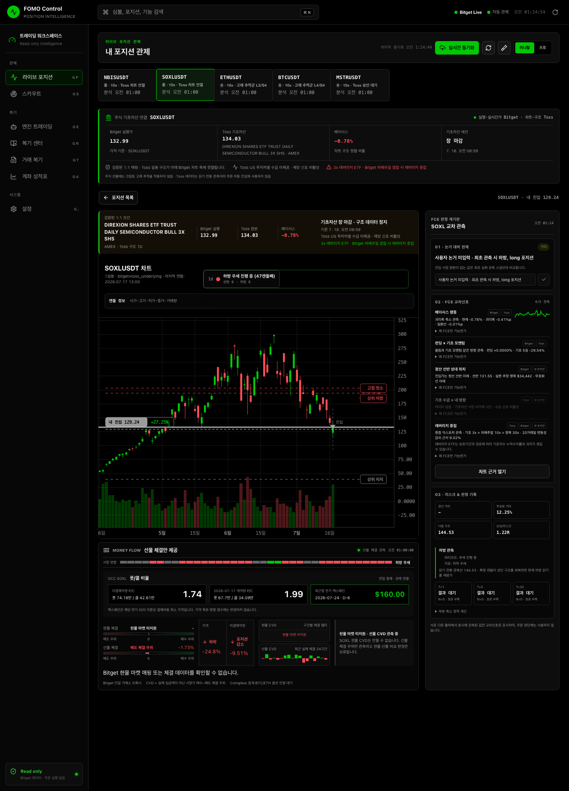

# WO-FCE-POSITION-DEEPDIVE-01 — 판정 계기판 해자화

우선순위: P0 — Bitget·Toss·내 포지션 교차 관측과 Judgment Ledger가 제품의 핵심 차별점이다.
선행: WO-FCE-UNIFIED-CHART-01, WO-FCE-TOSS-SCOUT-01, WO-FCE-BITGET-TOSS-MAP-01

## 착수 전 확인 (AGENTS.md 불변 규칙 2)

- [x] `git branch -a` 에 같은 WO 브랜치 없음
- [x] `git log --oneline -15` + `git status` 에 기존 구현 없음
- [x] `rg "WO-FCE-POSITION-DEEPDIVE-01" docs backend dashboard` 결과 기존 산출물 없음

## 진단 (코드 확정)

- `dashboard/components/position/CompactChartWorkspace.tsx`의 기존 우측 패널은 시장 방향·익절 압력·다음 가격만 표시해 단일 차트 분석과 구분되지 않았다.
- `backend/app/toss/instrument_join.py`는 검증된 Toss 기초자산 구조와 현재 베이시스를 제공하지만 포지션 판정에는 사용되지 않았다.
- `backend/app/toss/store.py`의 스카우트 판정 스키마는 T+1/T+5/T+20 결과를 이미 저장했지만 포지션 교차판정이 공유하지 않았다.
- `backend/app/derivatives/liquidation_heatmap.py`의 실현 청산 선반은 내 진입가·무효화선과 상대 위치를 계산하지 않았다.

## 작업

### 1. 진입 스냅샷

- 포지션 최초 심화 관측 시 `judgment_ledger`에 `position_entry_snapshot`을 한 번 저장한다.
- 실제 진입 시점 원본이 없으면 `first_observed_proxy`로 명시하고 과거 값을 소급 생성하지 않는다.
- 사용자가 입력한 논거를 우선하고, 없으면 최초 관측 자동 요약임을 표시한다.

### 2. 교차소스 판정

- Bitget 4시간 확정 종가와 Toss 조정 일봉 종가를 시간 정렬해 베이시스 스파크라인을 만든다.
- Bitget 펀딩과 Toss 5일 모멘텀, 실현 청산 선반과 내 가격, Toss 수급과 내 방향, 기초자산 레버리지와 내 계약 배율을 각각 분리 표시한다.
- 각 항목은 두 개 이상 소스 배지와 `moat_reason`을 갖는다. 데이터가 없으면 비활성으로 남긴다.

### 3. 포지션 리스크와 Ledger

- 청산·무효화 거리, 다음 구조 R, 기존 TA 근거와 읽기 전환 관측선을 제공한다.
- 25%/50% 축소는 주문이 아닌 정적 계산으로만 제공하고 가정을 함께 표시한다.
- 포지션 교차판정을 공용 `scout_judgment_snapshots/outcomes`에 기록해 실제 경과 시간 T+1/T+5/T+20을 자동 채점한다. 먼저 종료된 포지션도 기한이 도래한 심볼의 Bitget 공개 시세로 이어서 기록한다.
- 방향 해석이 가능한 교차신호만 유형별 적중 분포를 따로 계산하고, 방향성이 없는 관측에는 적중률을 만들지 않는다.

### 4. 3블록 UI

- 논거 대비 현재 / FCE 교차신호 / 리스크 & 판정 기록으로 우측 패널을 교체한다.
- 크립토 또는 검증되지 않은 RWA는 기존 범용 계기판을 유지하며 Toss 신호를 붙이지 않는다.

## 단일 소스로 만들 수 없는 이유

| 교차신호 | 필요한 소스 | 단일 소스 불가 근거 |
|---|---|---|
| 베이시스 행동 | Bitget × Toss | 퍼페추얼과 검증된 현물 기초자산의 동시 가격이 모두 필요하다. |
| 펀딩 × 기초 모멘텀 | Bitget × Toss | 계약 쏠림과 독립 기초자산 확정 일봉을 함께 비교해야 한다. |
| 청산 선반 상대 위치 | Bitget × 내 포지션 | 실현 청산 가격대만으로는 개인 진입가·무효화선의 상대 위치가 생기지 않는다. |
| 기초 수급 × 내 방향 | Toss × 내 포지션 | 투자자별 수급과 실제 보유 방향이 모두 필요하다. |
| 레버리지 중첩 | Toss × Bitget × 내 포지션 | 검증된 ETF 배율, 퍼페추얼 계약, 개인 적용 배율을 모두 알아야 한다. |

## 수용 기준

- [x] 블록 2의 모든 항목이 소스 2개 이상과 단일 소스 불가 근거를 포함한다.
- [x] 최초 관측 진입 스냅샷과 논거 유지/약화/무효 상태를 제공한다.
- [x] 실데이터 기반 베이시스 스파크라인과 실현 청산 선반 상대 위치를 제공한다.
- [x] SOXL 기초 3배와 Bitget 포지션 배율을 곱한 명목 실효 익스포저와 감쇠 근사를 표시한다.
- [x] 역행 상태의 구체 근거와 읽기 전환 관측선을 표시한다.
- [x] T+1/T+5/T+20 자동 기록과 N<30 표본 부족 표시를 제공한다.
- [x] 비거래 시간 Toss 수급 신호 비활성을 회귀 테스트한다.
- [x] SOXLUSDT 실포지션 3블록 스크린샷 확인
- [x] HARNESS 로컬 게이트 통과
- [ ] origin/main 반영과 CI success 확인

## 실데이터 검증 로그 (2026-07-19)

- SOXLUSDT 검증된 조인: Toss `SOXL` · AMEX · 3x leveraged ETF, Bitget 퍼페추얼 10x.
- 베이시스 행동: Bitget 4시간 확정 종가와 Toss 조정 일봉을 맞춘 실제 관측 48점, 마지막 현재 관측을 별도 표기.
- 실효 익스포저: 명목 30x, 최근 Toss 일봉 변동성 기반 20거래일 감쇠 근사와 경고 노출.
- 비거래 시간 회귀: Toss 기초자산 상태 `holiday`, 수급 신호 `unavailable/market_closed`.
- 실제 포지션 Ledger: 최초 판정 `c99f48c9-db69-5475-91c5-b9cebb2cd721` 저장, 아직 실제 T+1이 지나지 않아 outcome 0건으로 유지.
- 자동 결과 1사이클 테스트: `position-cycle-1`, T+1 실제 경과 전 0건 → 24시간 1분 뒤 1건, -10% 하락 읽기 적중, N=1 `sample_low=true`.
- UI: 1440px에서 우측 레일 340px, 390px 모바일에서 가로 overflow 0, 브라우저 콘솔 error 0.

## 금지

- 주문·자동 진입·포지션 축소 실행 경로를 추가하지 않는다.
- 최초 관측 이전 상태나 T+1 결과를 소급 생성하지 않는다.
- 미확정 캔들, 검증되지 않은 매핑, 미제공 수급값을 교차판정에 넣지 않는다.
- 적용된 마이그레이션을 수정하지 않는다.

## 문서

- `docs/PositionDeepDive.md`
- `docs/PRD.md`

## 완료 정의 (공통)

- [x] HARNESS.md 게이트 통과
- [x] docs 갱신
- [ ] origin/main 반영 + CI success 확인
